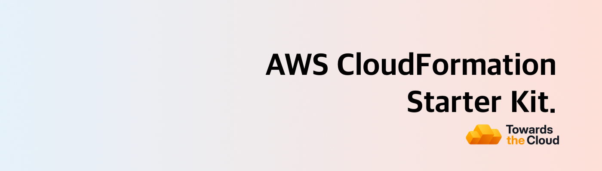

# [](https://towardsthecloud.com)

# AWS CloudFormation Starter Kit

Welcome to the AWS CloudFormation Starter Kit, designed to streamline your infrastructure setup using CloudFormation templates and the Rain tool. This repository provides a structured approach to managing your AWS resources as code, ensuring efficient and reliable deployments.

<!-- TIP-LIST:START -->
> [!TIP]
> **Towards the Cloud runs the AWS foundation for modern product teams. This means your team ships faster, slashes AWS spend, and stay audit-ready without having to hire a platform squad.**
>
> Unsure where to start? Book a free AWS Account Review. We’ll analyse your AWS environment, hand you a security & cost report, and you decide whether to act on it yourself or have us execute. No pressure, no retainer required up front.
>
> <a href="https://cal.com/towardsthecloud/aws-account-review"></a>
>
> <details>
> <summary>☁️ <strong>See how we turn AWS chaos into a compliant, cost-efficient platform…</strong></summary>
> <br/>
>
> ### The problem: AWS complexity compounds fast
>
> Ad‑hoc builds become 40–60% overspend, unmonitored security gaps put customer data at risk, and engineers burn out running infrastructure instead of shipping products.
>
> ### Our managed foundation keeps you moving forward
>
> - ✅ **Compliant Landing Zone** – [Multi-account AWS CDK deployment](https://towardsthecloud.com/services/aws-landing-zone) with 100% [CIS benchmark](https://docs.aws.amazon.com/securityhub/latest/userguide/cis-aws-foundations-benchmark.html) coverage,
> centralized logging, and SSO-ready access control.
> - ✅ **Production-ready CDK components** – Pre-hardened building blocks so teams launch new services without reinventing best practices.
> - ✅ **CI/CD with safe rollbacks** – GitOps workflows and governed pipelines that let you release faster with confidence.
> - ✅ **Quarterly cost & security reviews** – [Cost Optimisation](https://towardsthecloud.com/services/aws-cost-optimization) plus [Security Reviews](https://towardsthecloud.com/services/aws-security-review)
> delivered proactively.
> - ✅ **Fractional Cloud Engineer** – On-demand expertise from an architect who implemented enterprise-grade AWS infrastructure for over a decade.
>
> ### Outcomes our customers see
>
> - **30%+ lower AWS bill** – Continuous oversight prevents expensive drift ([30–60% documented savings](https://towardsthecloud.com/services/aws-cost-optimization#case-study)).
> - **SOC 2 / HIPAA acceleration** – Guardrails, logging, and evidence packs ready on day one.
> - **Audit-ready every quarter** – Automated monitoring plus recurring reviews keep findings under control.
> - **Faster product velocity** – Engineers build features, not managing infrastructure.
> - **Headcount leverage** – A [flexible retainer](https://towardsthecloud.com/pricing) replaces the cost of a full-time platform team.
>
> **Proof:** Y Combinator startup Accolade used our Landing Zone to [earn SOC 2 in record time](https://towardsthecloud.com/blog/aws-landing-zone-case-study-accolade):
>
> *“We achieved a perfect security score in days, not months.”* — Galen Simmons, CEO
>
> Ready to see where your AWS account stands? Grab a spot while they’re available:
>
> <a href="https://cal.com/towardsthecloud/aws-account-review"></a>
>
> </details>
<!-- TIP-LIST:END -->

## Features

- ⚡ **Quick Setup**: Get started with your infrastructure CI/CD in minutes by configuring a couple of repository variables.
- 🌐 **Environment Flexibility**: Supports multiple environments (e.g., dev, staging, prod) via GitHub Actions workflows.
- 🤖 **Automated Validation**: Use Checkov and cfn-lint for static analysis of your CloudFormation templates, ensuring compliance and security best practices.
- 🏗️ **Modular Structure**: Organize your templates into logical components for better manageability and scalability.
- 🔒 **Security Best Practices**: Incorporate OIDC for deploying cloudformation stacks in a secure manner in your AWS account via a GitHub Actions workflow.
- 📜 **Comprehensive Documentation**: Detailed README and inline comments to guide you through setup and deployment processes.
- 🚀 **CI/CD Integration**: Ready-to-use GitHub Actions workflows for automated deployments and validations.

## Setup Guide

> [!NOTE]
> Looking for the full setup guide? Visit the detailed documentation at [towardsthecloud.com/docs/aws-cloudformation-starter-kit](https://towardsthecloud.com/docs/aws-cloudformation-starter-kit).

This project requires **Python 3** and **pip** for managing dependencies.

**To get started, follow these steps:**

1. Clone this repository:

```bash
git clone https://github.com/towardsthecloud/aws-cloudformation-starter-kit.git
cd aws-cloudformation-starter-kit
```

1. Install checkov, cfn-lint via pip & rain via homebrew:

```bash
brew install rain
pip install -r requirements.txt
```

3. Run the `provision-repo.sh` script to generate the parameter and workflow files for your environment and in the repository with your AWS account information and the necessary variables for the OIDC provider.

```bash
./scripts/provision-repo.sh
```

4. Validate your CloudFormation templates with cfn-lint and checkov using the provided script:

```bash
./scripts/validate.sh
```

5. Deploy the oidc-provider CloudFormation stack using the `deploy-templates.sh` script:

```bash
./scripts/deploy-templates.sh
```

> [!WARNING]
> Make sure that you have the required IAM role or user setup in your aws config file. Use a tool such as [Granted](https://github.com/common-fate/granted) to make accessing your AWS account via the CLI easier and more secure.


Now that you have successfully deployed the OIDC provider, you can use the following steps to configure your GitHub repository with the necessary variables, so that the CI/CD workflow can be used to deploy your CloudFormation stacks.

6. Navigate to your repository's settings page on GitHub.
   1. In the left sidebar, click on "Secrets and variables".
   2. Click on "Actions" and then "New repository variable".
   3. add the following variables:

Note: Make sure to modify the values of the variables to match your specific account and region.


You can now use the provided GitHub Actions workflows to deploy your CloudFormation stacks. Simply commit your changes to the main branch of your repository by adding new stacks to the `./templates` folder and the workflow will automatically deploy your stacks.

## Project Structure

This starter kit is organized to promote best practices in managing CloudFormation templates:

```bash
.
├── .cfnlintrc
├── .checkov.yml
├── .github
│  ├── pull-request-template.md
│  └── workflows
      ├── cfn-lint-scan.yml
│     ├── checkov-scan.yml
│     └── cloudformation-deploy-test.yml
├── LICENSE
├── parameters
│  ├── production
│  │  └── oidc-provider.yml
│  └── test
│     └── oidc-provider.yml
├── README.md
├── requirements.txt
├── scripts
│  ├── provision-repo.sh
│  ├── deploy-templates.sh
│  └── validate-templates.sh
└── templates
   └── oidc-provider.yml
```

### Key Components

- `parameters/`: This directory contains parameter files for different environments, such as `production` and `test`. Each subdirectory corresponds to an environment and contains YAML files that define parameters specific to that environment. It's important to ensure that the filename of each parameter file matches the corresponding template name in the `templates/` directory. This naming convention allows scripts to correctly associate parameters with their respective templates during deployment.
- `.cfnlintrc`: This file is the configuration for cfn-lint, a tool used to validate CloudFormation templates against AWS best practices and syntax rules.
- `.checkov.yml`: This configuration file is used by Checkov, a static analysis tool for infrastructure as code. It defines the rules and policies that Checkov will enforce when scanning your CloudFormation templates.
- `.github/workflows/`: Contains GitHub Actions workflows for CI/CD.
- - `cfn-lint-scan.yml`: Automates the validation of CloudFormation templates using cfn-lint to ensure compliance with AWS best practices and syntax rules.
- - `checkov-scan.yml`: Automates the validation of CloudFormation templates using Checkov to ensure compliance and security.
- - `cloudformation-deploy-test.yml`: Manages the deployment of CloudFormation stacks for testing purposes.
- `scripts/`: Contains shell scripts for managing templates.
- - `deploy-templates.sh`: Automates the deployment of CloudFormation templates using the Rain tool.
- - `provision-repo.sh`: Generates the parameter and workflow files for your environment and in the repository with your AWS account information and the necessary variables for the OIDC provider.
- - `validate-templates.sh`: Validates CloudFormation templates using Checkov to ensure they adhere to best practices.
- `templates/`: Stores CloudFormation templates.
- - `oidc-provider.yml`: Example template for setting up an OpenID Connect provider in AWS.

## CI/CD Integration

This starter kit includes GitHub Actions workflows for automated validation and deployment. Customize the workflows in the `.github/workflows/` directory to suit your CI/CD needs.

Checkov Scan: Automatically runs Checkov on your templates to catch security and compliance issues before deployment.
CloudFormation Deploy Test: Deploys your CloudFormation stacks in a test environment to ensure everything works as expected.

## Start adding CloudFormation templates

To start adding CloudFormation templates, simply add new files to the [`./templates`](./templates) directory and commit them to the `main` branch of your repository to trigger the CI/CD workflow. The workflow will automatically deploy your stacks using the provided parameter files.

Here are a couple of repositories containing CloudFormation templates that you can use as a starting point:

- [Official AWS CloudFormation Templates](https://github.com/aws-cloudformation/aws-cloudformation-templates)
- [Widdix's AWS CloudFormation Templates](https://github.com/widdix/aws-cf-templates)
- [AWS Quick Start Templates](https://github.com/aws-quickstart/quickstart-examples)

## AWS CDK Starter Kit

> **Looking for a more modern approach to managing your AWS infrastructure?** Consider using the [AWS CDK Starter Kit](https://github.com/towardsthecloud/aws-cdk-starter-kit) for a tailored experience that leverages the full power of AWS CDK with TypeScript.

AWS CDK offers several advantages over traditional CloudFormation, such as improved developer experience through the use of familiar programming languages, higher abstraction with reusable constructs, and seamless integration with development workflows. These features make AWS CDK a highly recommended choice for more efficient and flexible infrastructure management.

[Explore the AWS CDK Starter Kit](https://github.com/towardsthecloud/aws-cdk-starter-kit) and start building your infrastructure with greater efficiency and flexibility today!

## Acknowledgements

Special thanks to the creators of [Rain](https://github.com/aws-cloudformation/rain), [Checkov](https://github.com/bridgecrewio/checkov), and [cfn-lint](https://github.com/aws-cloudformation/cfn-lint) for their invaluable tools that make infrastructure management easier and more secure.

## Author

[Danny Steenman](https://towardsthecloud.com/about)

[](https://www.linkedin.com/company/towardsthecloud)
[](https://twitter.com/dannysteenman)
[](https://github.com/towardsthecloud)
